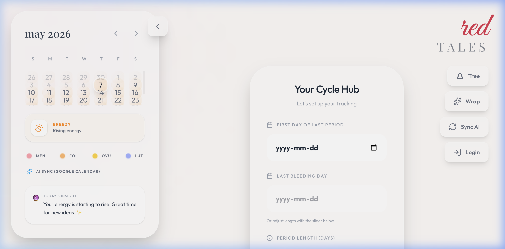
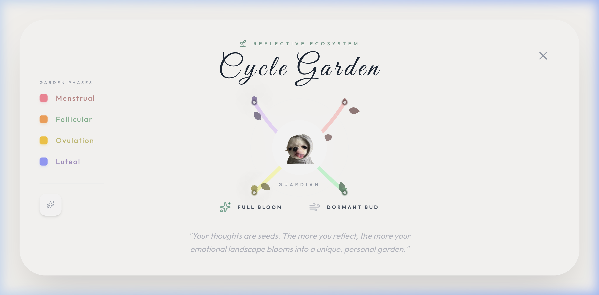
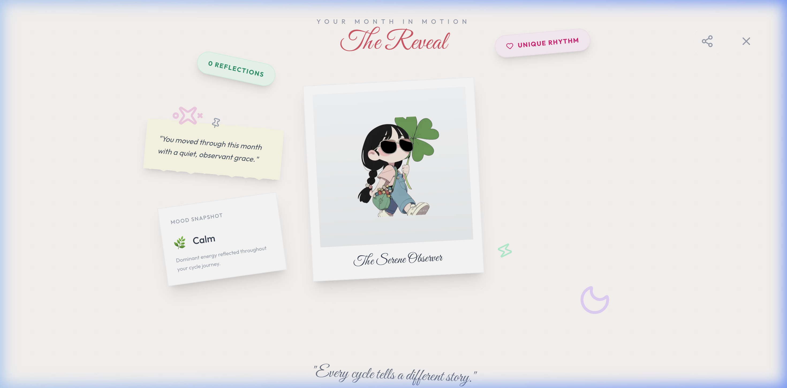

# 🌹 RedTales AI: Your Cycle-Synchronized Life Assistant

## 📸 Showcase

<p align="center">
  
</p>

<p align="center">
  
  
</p>

**RedTales AI** is a holistic, AI-powered wellness application designed to help individuals track their menstrual cycles and optimize their daily activities based on their physiological energy levels. By combining cycle tracking with Google Calendar/Tasks integration and Gemini AI, RedTales provides personalized recommendations that harmonize your schedule with your body's natural rhythms.

---

## ✨ Key Features

- **🌙 Intelligent Cycle Tracking**: Track your menstrual phases (Menstrual, Follicular, Ovulation, Luteal) with a beautiful, intuitive interface.
- **🤖 AI-Driven Recommendations**: Powered by **Google Gemini**, the app suggests specific activities based on your current energy phase (e.g., high-focus work during follicular phase, or restorative rest during the menstrual phase).
- **📅 Seamless Ecosystem Integration**:
  - **Google Calendar**: Automatically schedule restorative events and reminders.
  - **Google Tasks**: Sync high-energy tasks directly to your to-do list.
- **🧠 Reflection Network**: A unique "Tree of Reflections" that visualizes your mental and physical states over time, building a historical map of your wellness journey.
- **🔐 Secure Authentication**: Integrated with **Auth0** and **Google OAuth** for secure data management and easy access to your Google services.
- **📊 Monthly Wrap-ups**: Insightful summaries of your cycle data and reflections to help you identify long-term patterns.

---

## 🛠️ Tech Stack

### Backend
- **Framework**: [FastAPI](https://fastapi.tiangolo.com/) (Python)
- **AI Integration**: [Google Gemini API](https://ai.google.dev/)
- **Authentication**: [Auth0](https://auth0.com/) & [Google OAuth2](https://developers.google.com/identity/protocols/oauth2)
- **External APIs**: Google Tasks API, Google Calendar API
- **Deployment**: Uvicorn

### Frontend
- **Framework**: [React](https://reactjs.org/) with [Vite](https://vitejs.dev/)
- **Styling**: [Tailwind CSS](https://tailwindcss.com/)
- **Animations**: [Framer Motion](https://www.framer.com/motion/)
- **Icons**: [Lucide React](https://lucide.dev/)
- **State Management**: React Hooks & LocalStorage (Persistence)

---

## 🚀 Getting Started

### Prerequisites
- Python 3.9+
- Node.js 18+
- Google Cloud Project with Tasks and Calendar APIs enabled.
- Gemini AI API Key.
- Auth0 Account.

### Installation

1. **Clone the repository**:
   ```bash
   git clone https://github.com/JanasiRajput/BearHack2026.git
   cd BearHack2026
   ```

2. **Backend Setup**:
   ```bash
   cd backend
   python -m venv .venv
   source .venv/bin/activate  # On Windows: .venv\Scripts\activate
   pip install -r requirements.txt
   ```
   Create a `.env` file in the `backend` directory:
   ```env
   GEMINI_API_KEY=your_gemini_key
   AUTH0_DOMAIN=your_auth0_domain
   AUTH0_AUDIENCE=your_auth0_audience
   FRONTEND_URL=http://localhost:5173
   ```

3. **Frontend Setup**:
   ```bash
   cd ../RedTales
   npm install
   ```
   Create a `.env` file in the `RedTales` directory:
   ```env
   VITE_API_URL=http://localhost:8000
   VITE_AUTH0_DOMAIN=your_auth0_domain
   VITE_AUTH0_CLIENT_ID=your_auth0_client_id
   ```

### Running the App

- **Start Backend**:
  ```bash
  cd backend
  uvicorn main:app --reload
  ```
- **Start Frontend**:
  ```bash
  cd RedTales
  npm run dev
  ```

---

## 📁 Project Structure

```text
BearHack2026/
├── backend/                # FastAPI Python Backend
│   ├── auth_utils.py       # JWT and OAuth verification
│   ├── gemini_utils.py     # Gemini AI logic & fallbacks
│   ├── google_utils.py     # Google Calendar/Tasks integration
│   ├── main.py             # API routes and middleware
│   └── requirements.txt    # Backend dependencies
├── RedTales/               # React Vite Frontend
│   ├── src/
│   │   ├── components/     # UI Components (Modals, Cards, Hub)
│   │   ├── data/           # Phase data and cycle utilities
│   │   └── App.jsx         # Main application logic
│   └── package.json        # Frontend dependencies
└── README.md               # Project documentation
```

---

## 🎨 Design Philosophy

RedTales AI follows a **"Soft & Organic"** design aesthetic, utilizing glassmorphism, subtle gradients, and nature-inspired colors (Rose, Pink, Emerald). The goal is to create a calming environment that reduces the stress of tracking and scheduling.

---

## 🏆 Hackathon Submission

Developed for **BearHack 2026**.
Dedicated to empowering individuals through data-driven wellness and AI-assisted scheduling.
